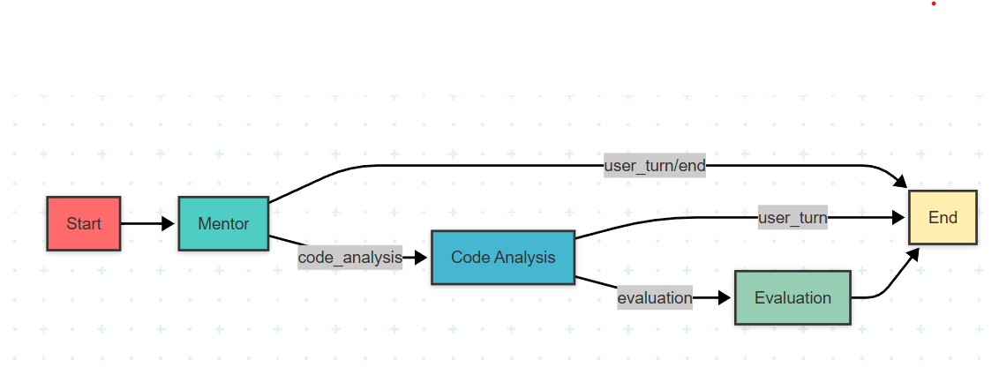
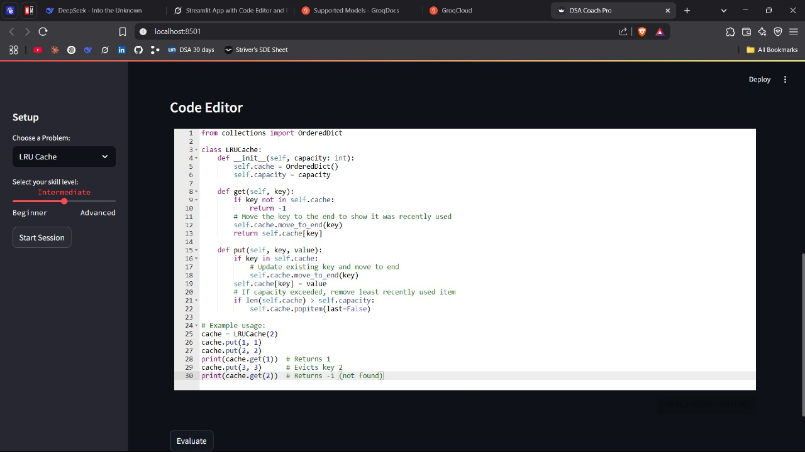
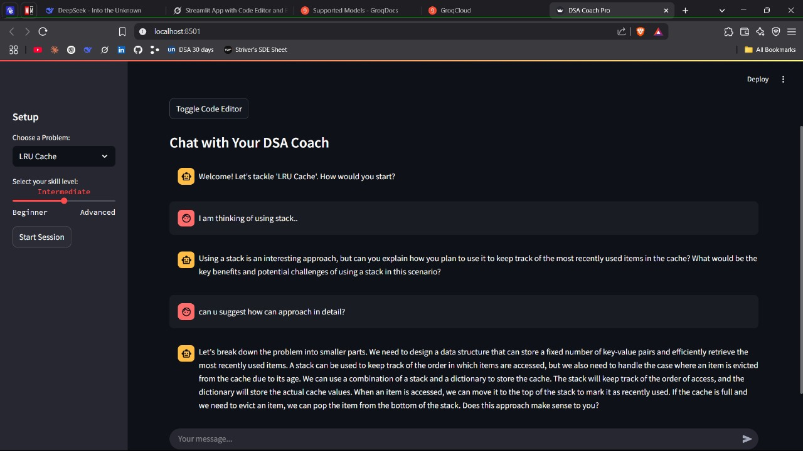

# 🧠 DSA Coach Pro – AI-Powered DSA Preparation Platform

DSA Coach Pro is a LangGraph-based AI-driven platform built to guide users through Data Structures & Algorithms (DSA) problem-solving with personalized mentorship. Developed for the **Espyr Hackathon**, it simulates a LeetCode-like environment enhanced with intelligent agents, adaptive skill feedback, and real-time code evaluation.



---

## 🚀 Features

- 💬 **Mentor Agent** – Guides users through understanding, planning, and coding with personalized prompts.
- 🧑‍💻 **Code Agent** – Analyzes user code, generates test cases, suggests improvements.
- 📊 **Evaluation Agent** – Summarizes performance based on hints, code quality, and correctness.
- 🎯 **Persona Manager** – Adjusts difficulty and tone based on user skill level.
- 🧠 **Orchestrator** – Manages seamless transitions between agent steps using LangGraph.
- 🖥️ **Streamlit Frontend** – Clean UI with a code editor, chat interface, and real-time feedback.

---

## 🖼️ Screenshots

### Code Editor
Write and test code in a full-featured Python editor with syntax highlighting.



### Mentor Chat
Interact with the AI mentor for guided problem-solving and hints.



### Code Testing
Submit solutions and receive detailed feedback on correctness.


---

## 🧩 Architecture

### Tech Stack
- **Frontend**: Streamlit, `streamlit-ace`
- **AI/Agents**: LangGraph, Groq API (LLaMA-3.3-70B), LangChain
- **Database**: SQLite (for problem storage)
- **Language**: Python 3.11+

### Agent Workflow Diagram

```plaintext
User Input
   ↓
Mentor Agent ──> Code Agent ──> Evaluation Agent ──> Persona Manager
       ↑              ↓                 ↓                     ↓
   Feedback <── Retry ────── Pass ───── Summary ───── Update Skill
```

---

## ⚙️ How to Run Locally

### 1. Clone the Repository

```bash
git clone https://github.com/your-username/dsa-coach-pro.git
cd dsa-coach-pro
```

### 2. Install Dependencies

```bash
pip install -r requirements.txt
```

### 3. Set Up Secrets

Create a `.env` file or use `st.secrets` in Streamlit for:

```ini
GROQ_API_KEY=your_groq_api_key_here
```

### 4. Run the App

```bash
streamlit run frontend/app.py
```

---

## 📚 DSA Problems Included

Stored in `dsa_problems.db`:

1. **Two Sum** – Easy
2. **Reverse Linked List** – Easy
3. **Longest Substring Without Repeating Characters** – Medium
4. **Merge Intervals** – Medium
5. **Maximum Subarray** – Medium

---

## 📁 Project Structure

```
dsa-coach-pro/
│
├── agents/                # All AI agent logic
├── database/              # SQLite setup and queries
├── frontend/              # Streamlit frontend app
├── demo/                  # Standalone test/demo scripts
├── docs/                  # Images and documentation
├── utils/                 # Utility scripts and testing
├── .env, requirements.txt, README.md
```

---

## 🧠 Inspiration & Goal

> **"Everyone needs a coach—even for DSA."**

This project aims to make DSA preparation more accessible, adaptive, and intelligent for all learners, especially those struggling with self-paced platforms. With AI mentorship, real-time testing, and performance feedback, DSA Coach Pro turns practice into progress.

---

## 🤝 Contributors

* **Shadan Anwar** – Developer & System Designer

Special thanks to **Espyr Hackathon** for the platform and challenge!

---

## 📌 License

This project is open-source and available under the [MIT License](LICENSE).

---

## 🔗 Useful Links

* [LangGraph](https://github.com/langchain-ai/langgraph)
* [Groq API](https://console.groq.com/)
* [Streamlit](https://streamlit.io/)
